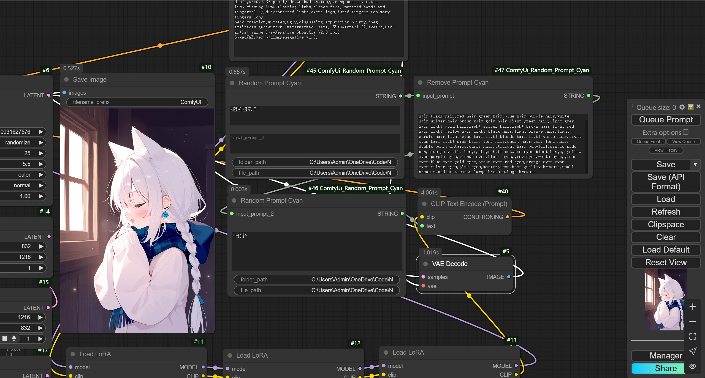

# 自动抽图抽串节点

## 操作习惯沿袭nai3自动跑图脚本

    使用新版载入方式，旧版的comfyui可能不支持，如果出现找不到节点，请更新comfyui

### Random Prompt Cyan 节点使用

- input_prompt_1 和 input_prompt_2 用于输入prompt

- folder_path 是`<随机提示词>`的路径，是一种以txt文件为单位抽取的方式，如果在文本框写入了`<随机提示词>`，则会抽取该路径的txt来替换`<随机提示词>`

- file_path 是`<文件名>`的路径，如果在文本框内写了`<文件名>`，则会抽取该文件夹下`文件名`的txt中的其中一行来替换`<文件名>`
    举个比方`<动作>`会抽取设定文件夹下`动作.txt`中的其中一行来替换

### Remove Prompt Cyan 节点使用

- 删除输入的prompt中的所有单词，用,隔开，会自动检查空格和下划线，所以只要输入带空格的单词就可以
- 用于删掉随机prompt中的人物特征